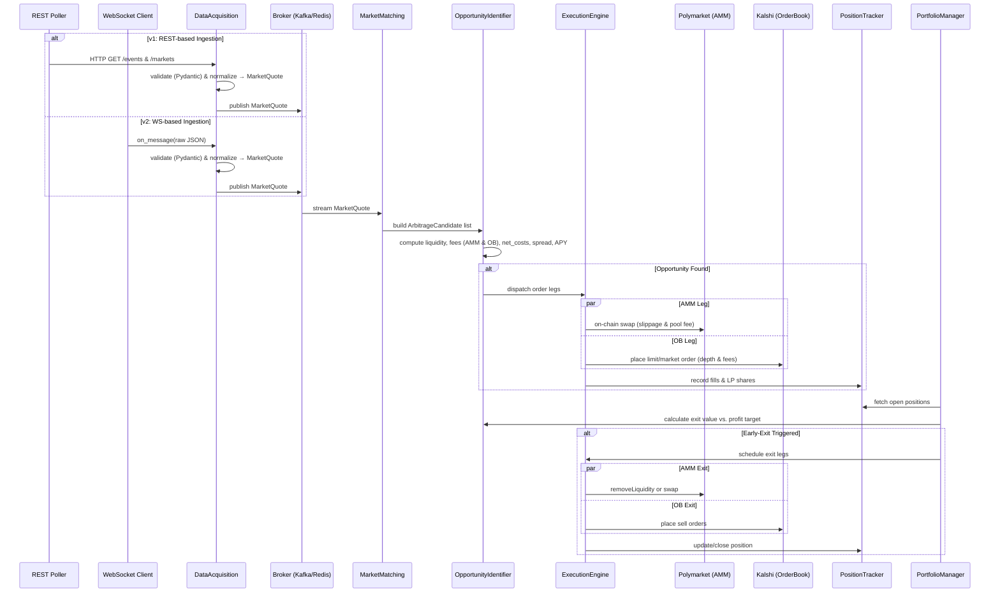

```mermaid
sequenceDiagram
    participant Poller as REST Poller
    participant WS as WebSocket Client
    participant DA as DataAcquisition
    participant BK as Broker (Kafka/Redis)
    participant MGR as MarketMatching
    participant ID as OpportunityIdentifier
    participant EXE as ExecutionEngine
    participant PM as Polymarket (AMM)
    participant KL as Kalshi (OrderBook)
    participant PT as PositionTracker
    participant PF as PortfolioManager

    alt v1: REST-based Ingestion
        Poller->>DA: HTTP GET /events & /markets
        DA->>DA: validate (Pydantic) & normalize → MarketQuote
        DA->>BK: publish MarketQuote
    else v2: WS-based Ingestion
        WS->>DA: on_message(raw JSON)
        DA->>DA: validate (Pydantic) & normalize → MarketQuote
        DA->>BK: publish MarketQuote
    end

    BK->>MGR: stream MarketQuote
    MGR->>ID: build ArbitrageCandidate list
    ID->>ID: compute liquidity, fees (AMM & OB), net_costs, spread, APY
    alt Opportunity Found
        ID->>EXE: dispatch order legs
        par AMM Leg
            EXE->>PM: on-chain swap (slippage & pool fee)
        and OB Leg
            EXE->>KL: place limit/market order (depth & fees)
        end
        EXE->>PT: record fills & LP shares
    end

    PF->>PT: fetch open positions
    PF->>ID: calculate exit value vs. profit target
    alt Early-Exit Triggered
        PF->>EXE: schedule exit legs
        par AMM Exit
            EXE->>PM: removeLiquidity or swap
        and OB Exit
            EXE->>KL: place sell orders
        end
        EXE->>PT: update/close position
    end
```