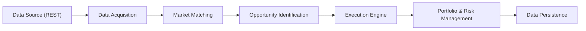

# Arbytron: Technical Specification

## 1. Introduction  
**Arbytron** is an automated arbitrage bot for multi-outcome prediction markets. It continuously monitors multiple venues, identifies price inefficiencies, executes simultaneous trades to lock in guaranteed profit, and manages open positions until exit conditions are met.

### 1.1 Goals  
- Spot cross-platform arbitrage when the sum of best “buy” prices < 100%.  
- Execute buys and sells with minimal latency.  
- Monitor positions & perform early-exit when profit thresholds hit.  
- Enforce risk controls (slippage, capital limits, fees, API error handling).

---

## 2. High-Level Architecture  



---

## 3. Components

### 3.1 Data Acquisition Layer  
- **Connectors** for each platform (e.g. Kalshi, PredictIt, …).  
- **REST client** (using `requests` or `httpx`) to poll for open events & order books.  
- **WebSocket client** (using `asyncio`+`websockets`) for live updates.  
- **Rate-limit & retry** logic, error handling, back-off.  
- Normalizes raw JSON → internal model:  
```python
class MarketQuote:
    platform: str
    event_id: str
    market_id: str
    outcomes: Dict[str, PriceLevel]  # {'Yes': {'bid': x, 'ask': y}, …}
    timestamp: datetime
```

### 3.2 Market Matching Module  
- **Goal**: map identical events/markets across platforms.  
- **Techniques**:  
  - Exact match on `event_ticker` / `series_ticker`.  
  - Fuzzy title matching (Levenshtein / token overlap).  
  - Time window & category filters.  
- Output: list of `ArbitrageCandidate` objects:  
```python
class ArbitrageCandidate:
    event_key: str
    platform_quotes: List[MarketQuote]
```

### 3.3 Opportunity Identification  
- For each `ArbitrageCandidate`:
  1. **Quote Retrieval & Liquidity**:
     - **AMM**: fetch pool reserves; compute effective ask using constant-product slippage formula for desired quantity.
     - **Order-Book**: fetch depth; calculate volume-weighted average ask for desired quantity.
  2. **Fee Computation**:
     - **AMM**: pool fee rate (e.g. 0.3%) + gas cost estimate.
     - **Order-Book**:
       - **Trading Fee**: ceil(0.07 × C × P × (1 − P)) per contract (round up to next cent).
       - **Maker Fee**: ceil(0.0025 × C) for designated series tickers on execution of resting orders; track cumulative rounding and rebate any excess > $10/month.
       - **Withdrawal/Settlement Fee**: platform-specific flat/percentage fee.
  3. Compute **net_costs** = Σ (effective ask + all fees) per outcome.
  4. Compute **spread%** = (1.00 – net_costs).
  5. Compute **APY** = (spread% / days_to_resolution) × 365.
- **Liquidity Checks**: ensure pool depth or order-book volume ≥ required qty per leg; skip if insufficient.
- Trigger if `spread% ≥ min_spread` **OR** `APY ≥ min_apy`.

### 3.4 Execution Engine
- **Platform-specific Execution**:
  - **AMM (Polymarket)**: execute on-chain swaps via pool contracts; set slippage tolerance & gas buffer; estimate price impact; monitor tx confirmations.
  - **Order-Book (Kalshi)**: place limit/market orders via REST/WS; monitor order-book depth; handle partial fills & rebalancing.
- **Order Router**: fan-out simultaneous legs across on-chain & off-chain channels.
- **Atomicity**: best-effort multi-leg execution; track per-leg status & rollbacks.
- **Slippage & Impact Control**: separate tolerances for AMM price impact and OB order slippage.
- **Fallback**: cancel or adjust remaining legs on failure.

### 3.5 Portfolio & Early-Exit Logic
- **Position Tracking**: record per-leg details (platform, market type, fill qty, LP shares).
- **AMM Exit**: compute exit value via pool swap quotes (fees & impact); trigger `removeLiquidity` or swap tx with slippage tolerance.
- **Order-Book Exit**: poll best bids; place limit/market sell orders per leg; manage partial exits & rebalance.
- **Early-Exit Thresholds**: configurable separate profit/slippage targets per market type.
- **Resolution Handling**: ensure on-chain tx confirmations or order fills before event close.

### 3.6 Risk Management  
- **Fee Estimation**: accurately compute and log all fee components for PnL:
  - **AMM**: pool fee rate + gas estimate.
  - **Kalshi Trading Fee**: ceil(0.07 × C × P × (1 − P)).
  - **Kalshi Maker Fee**: ceil(0.0025 × C) for designated series; apply monthly rebate for rounding > $10.
  - **Withdrawal/Settlement Fees**: platform-specific.
- **Capital Allocation**: global & per-platform limits.  
- **Slippage Limits**: per-trade max.  
- **API Safeguards**: rate-limit, circuit breaker, failover.  
- **Data Validation**: sanity checks on returned prices, volumes.

---

## 4. Data Persistence & Logging  
- **Database**: PostgreSQL for positions, trades, historical quotes.  
- **Cache/Queue**: Redis for in-flight position state & pub/sub.  
- **Logging**: structured JSON logs → ELK stack.  
- **Metrics**: Prometheus for QPS, latencies, PnL, open positions.

---

## 5. Infrastructure & Deployment  
- **Containerization**: Docker images per service (acquisition, matching, execution).  
- **Orchestration**: Kubernetes or AWS ECS + auto-scaling.  
- **Configuration**: YAML/ENV-based (secrets in AWS Secrets Manager).  
- **CI/CD**: GitHub Actions for test, build, deploy to staging/prod.

---

## 6. Security & Configuration  
- Store API keys securely (Vault/Secrets Manager).  
- TLS for all outbound calls.  
- Role-based access to infra.  
- Configurable thresholds:  
```yaml
min_spread: 0.01        # 1%  
min_apy: 50            # 50% APY  
slippage_limit: 0.005  # 0.5%  
max_capital_per_trade: 1000  # USD  
```

---

## 7. Monitoring & Alerting  
- **Dashboards**: Grafana for latency, fill rates, PnL curves.  
- **Alerts**: Slack/email on execution failures, PnL drawdowns, API errors.

---

## 8. Testing & Simulation  
- **Unit tests** for all modules.  
- **Integration tests** with mock exchanges.  
- **Paper-trading mode** to validate logic before live deployment.  
- **Load tests** to ensure latency & throughput.

---

## 9. Roadmap & Next Steps  
1. Build connectors & data-model schemas.  
2. Implement matching & identification logic.  
3. Simulate end-to-end arbitrage in paper mode.  
4. Add execution engine with real APIs.  
5. Deploy to staging, monitor performance.  
6. Go live with small capital, iterate on risk parameters.

---

# Scalable REST-Client Tech Stack

We’ll build the REST client as a lightweight, async Python microservice that can evolve into a full streaming ingestion pipeline.

## Core Language & Runtime  
- **Python 3.11+** for performance (zero-cost exceptions, pattern matching).  
- **asyncio** as the concurrency backbone.

## HTTP Layer  
- **httpx.AsyncClient**  
  • HTTP/2, connection pooling, timeout control.  
  • Pluggable transport for advanced features (e.g. HTTP/3 in the future).  
- **tenacity** for retry/back-off policies (exponential back-off, jitter).

## Schema & Validation  
- **Pydantic** (`BaseModel`, `BaseSettings`)  
  • Strongly-typed request/response models.  
  • Env-driven config (API keys, endpoints, thresholds).  
- **datamodel-codegen** (optional) to auto-generate Pydantic models from OpenAPI/JSON-Schema.

## Dependency Injection  
- **dependency-injector** or **wired**  
  • Decouple transport, models, business logic.  
  • Swap REST ↔ WebSocket connectors behind a common interface.

## Message Buffering & Handoff  
- **aiokafka** for Kafka  
  • Durable, multi-consumer streams.  
- **aioredis** (Streams) as lightweight fallback.  
- Abstract behind a `Publisher` interface so you can swap broker tech without rewriting ingestion logic.

## Logging & Metrics  
- **structlog** or **loguru**  
  • Contextual, structured JSON logs.  
- **prometheus_client**  
  • Instrument endpoint latencies, retry counts, queue lag.  
- **OpenTelemetry** (optional) for distributed tracing.

## Containerization & Deployment  
- **Docker** + **Docker Compose** for local dev.  
- **Kubernetes** (or AWS ECS/Fargate) in prod, with Horizontal Pod Autoscaler on CPU/queue lag.  
- **Envoy** or **Istio** sidecar for mTLS, circuit-breaking, rate-limiting.

## CI/CD & Quality  
- **pre-commit** (black, isort, mypy, flake8).  
- **GitHub Actions** or **GitLab CI** for lint, test, build image, and push.  
- **pytest-asyncio** for async unit/integration tests.

---

## Evolution Path  
1. **v1 (REST only)**: httpx + tenacity → aiokafka producer.  
2. **v2 (Hybrid)**: introduce WebSocket connector behind same `Connector` interface.  
3. **v3 (Full streaming)**: switch default to WS + Kafka; legacy REST connectors remain.  
4. **v4 (Big-Data)**: spin off a Kafka→Flink/Faust service for real-time enrichment, keeping the REST client focused on ingestion.

This stack ensures you can start simple, then seamlessly layer on streaming, brokering, and big-data frameworks as you hit throughput or latency limits.